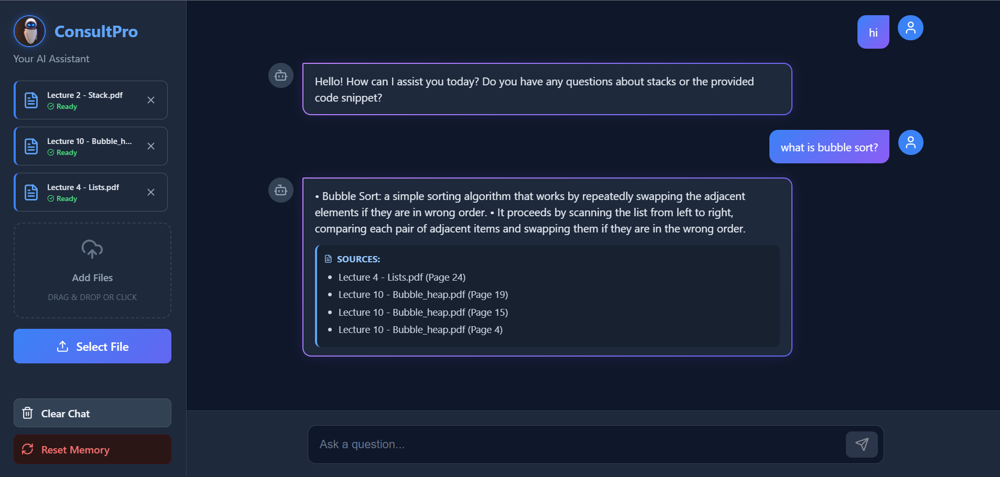
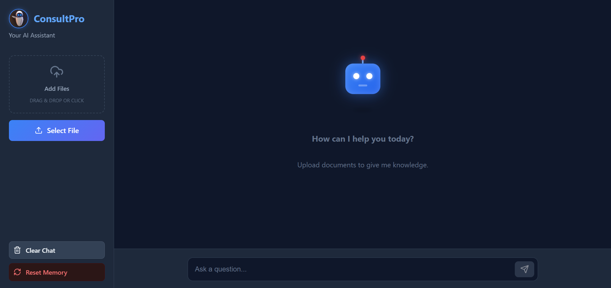
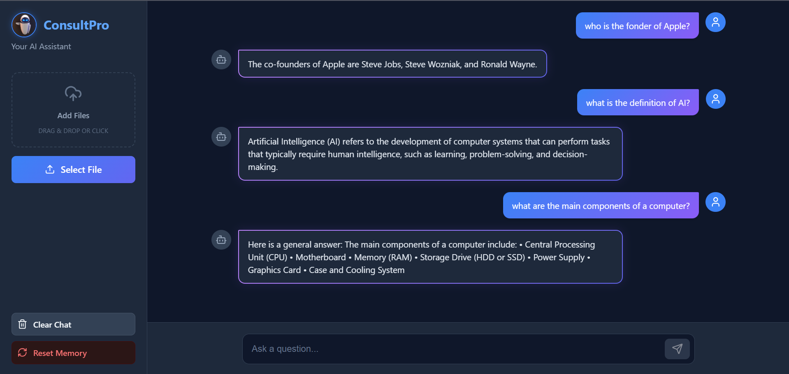

# 🤖 Local Hybrid RAG Chatbot




**ConsultPro** is a powerful, privacy focused AI assistant that enables you to chat with your documents completely offline. Built with a modern full stack architecture, it leverages **Retrieval-Augmented Generation (RAG)** to provide accurate answers with page-level citations from  PDFs, Word docs and PowerPoint slides.

---

## 🚀 Features

* **📂 Multi-Format Ingestion:** Seamlessly upload and chat with **PDFs**, **DOCX** and **PPTX** files.
* **🧠 Local AI Processing:** Powered by **Ollama (Llama 3.2)**, ensuring 100% data privacy with no cloud dependencies.
* **⚡ Smart Caching System:**
    * Files are physically stored in a local `data/` folder.
    * Re-uploading the same file skips the transfer and instantly re-indexes the content.
* **📖 Precision Citations:** Every answer includes exact **source filenames** and **page numbers** (e.g., `Lecture 2.pdf (Page 5)`).
* **🛡️ Intelligent Context Filter:**
    * Detects general chit-chat (e.g., "Hi") and hides sources.
    * Detects out-of-context questions and switches to general knowledge mode seamlessly.
* **🧹 Memory Management:** A **"Reset Brain"** button wipes the Vector Database for a fresh start without deleting your physical files.
* **📝 Concise & Structured Answers:** The AI is tuned to provide short, bullet-pointed summaries to avoid information overload.

---

## 🛠️ Tech Stack

### **Backend**
*  **FastAPI**: High-performance API framework.
*  **LangChain**: Framework for RAG pipeline and chain management.
*  **ChromaDB**: Local vector store for embeddings.
*  **Ollama**: Local LLM runner (Llama 3.2 + Nomic Embeddings).

### **Frontend**
*  **React.js**: Component-based UI library.
*  **TypeScript**: For type-safe code.
*  **Tailwind CSS**: Utility-first styling for a clean, modern UI.
*  **Vite**: Fast frontend build tool.

---

## 📦 Installation & Setup

### **1. Prerequisites**
Ensure you have **Ollama** installed and the models pulled:
```bash
ollama pull llama3.2:3b
ollama pull nomic-embed-text
```
### **2.  Backend Setup**
Navigate to the backend folder and create a virtual environment:
```bash
cd backend
python -m venv venv
# Activate venv:
# Windows: venv\Scripts\activate
# Mac/Linux: source venv/bin/activate

pip install -r requirements.txt
uvicorn main:app --reload
```
### **3.  Backend Setup**
Navigate to the frontend folder:
```bash
cd frontend
npm install
npm run dev
```
---
## 📸 Screenshots
| Dashboard View | Chat Interface |
| :---: | :---: |
|  |  |
---
## 🤝 Contributing
#### Contributions are welcome! Feel free to open an issue or submit a pull request.
---
## 📄 License
#### Distributed under the Apache License. See [LICENSE](/LICENSE) for more information.
---


